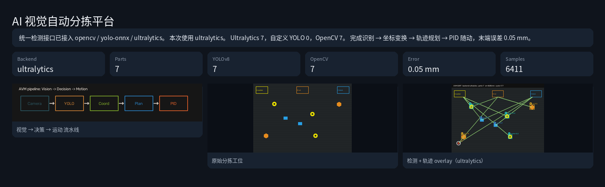
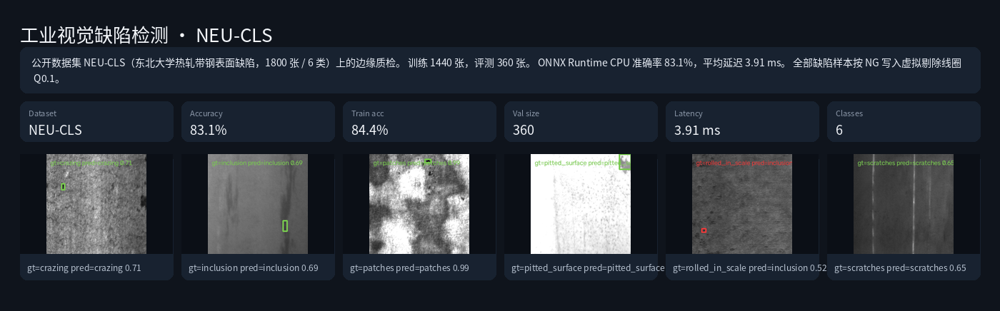
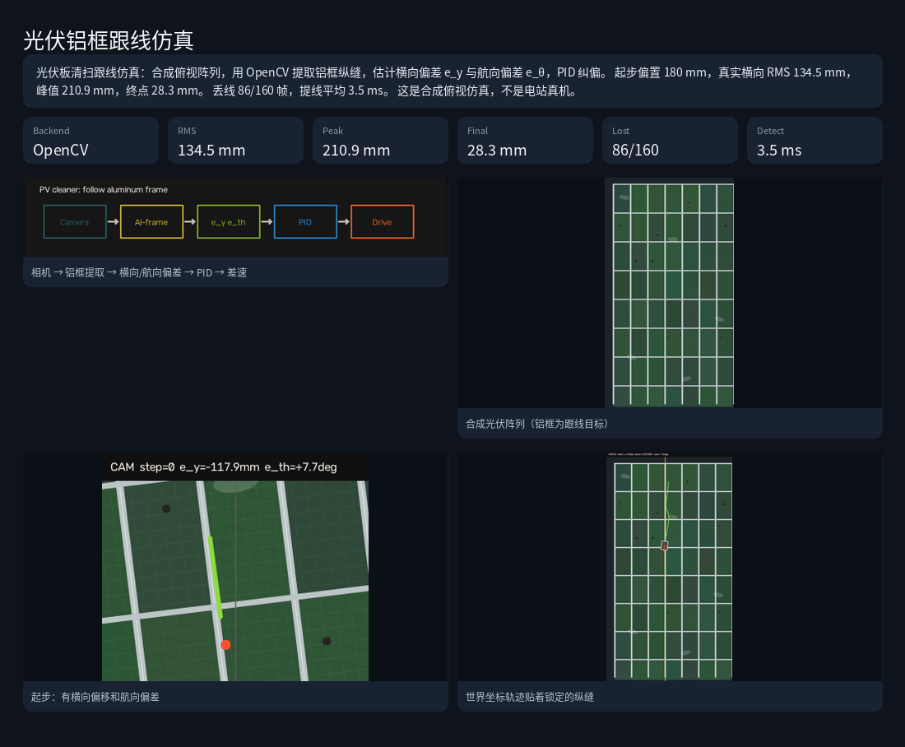

# AI Vision & Motion Control Platform

工业边缘视觉 + 运动控制平台。一个仓库，三个可演示作品：

1. **AI 视觉自动分拣**
2. **工业视觉缺陷检测 / Edge 部署**（NEU-CLS 公开数据集）
3. **光伏铝框跟线**（清扫车沿组件缝走直，合成俯视仿真）

没有开发板、工业相机、伺服时，也能跑通仿真闭环。检测后端可切换：`opencv` / `yolo-onnx` / `ultralytics`（官方 YOLOv8n + 分拣三类微调）。同一套 PID 已下沉到 STM32 风格 C 固件，可在本机或 Wokwi Nucleo-C031 上跑。

当前是 **PC 仿真 + 公开/合成数据 + 虚拟 IO + MCU 固件仿真**。不是产线真机，也不是运动控制卡 / EtherCAT。ROS2 未接入。

## 架构

```text
Camera / Dataset
      ↓
 Vision Engine (OpenCV)
      ↓
 AI Inference (ONNX Runtime)
      ↓
 Coordinate Transform
      ↓
 Motion Planner + PID  (C++ / STM32 C)
      ↓
 Gantry Sim  或  Wokwi Nucleo (UART + PWM)
      ↓
 Reject IO / Bin
```

分拣默认走 PC 上的 `avm-motion`。STM32 固件用同一套 PID，协议是 `T x y`，Wokwi 里用两路舵机表示轴。

## 依赖

- CMake 3.20+、Ninja、gcc / g++
- Python 3.12+
- 可选：`unrar`、`gdown`（重新下载 NEU-CLS）
- 可选：Cursor / VS Code 的 Wokwi 扩展（仿真 Nucleo）

本机 WSL 工具链见 [docs/environment.md](docs/environment.md)。

## 快速开始

```bash
python3 -m venv .venv
source .venv/bin/activate
pip install -r requirements.txt
source scripts/env.sh
bash scripts/run_all.sh
```

也可以分步跑：

```bash
cmake -S . -B build -G Ninja
cmake --build build -j$(nproc)
ctest --test-dir build --output-on-failure
python apps/inspector/run.py
python apps/sorter/run.py
python apps/pv_cleaner/run.py
./build/embedded/stm32/avm-mcu-sim --target 0.12,0.08
```

### 首次复现

| 步骤 | 说明 |
|---|---|
| 质检数据 | 需要 `data/NEU-CLS/`。没有就按 [data/README.md](data/README.md) 下载 |
| 分拣权重 | 已有 `output/sorter/yolov8/sorter/weights/best.pt` 则跳过微调；否则会生成合成集并训练 YOLOv8n |
| 质检模型 | 每次运行会重训 MLP 并导出 ONNX，通常一两分钟 |
| 完整分拣 | 默认 `ultralytics`。首次无缓存时可能超过 10 分钟；快速看链路可用 `opencv` 后端 |
| STM32 | `ctest` 已覆盖 MCU PID。不需要板 |

产物：

- `output/sorter/report.html`
- `output/inspector/report.html`
- `output/pv_cleaner/report.html`

报告是单文件 HTML（图片和中文字体已内嵌），用浏览器打开。不要在编辑器里当源码预览。WSL 下可用：

```bash
bash scripts/open_report.sh sorter
bash scripts/open_report.sh inspector
bash scripts/open_report.sh pv_cleaner
```

## 运行结果

### 分拣报告

YOLOv8 微调识别垫圈 / 螺母 / 方块，单应性变换后由 C++ 梯形规划 + PID 龙门仿真入槽。本次 7 个工件，末端误差约 0.05 mm。



### 质检报告

NEU-CLS（1800 张 / 6 类）上训练 MLP，导出 ONNX 后用 ONNX Runtime CPU 推理。本次评测准确率约 83%，平均延迟约 4 ms。



### 光伏铝框跟线

合成俯视光伏阵列，OpenCV 提取铝框纵缝，用横向/航向偏差做 PID 走直。起步偏置 180 mm，能贴回锁定纵缝，提线约 3 ms。不是电站真机。详见 [docs/pv_cleaner.md](docs/pv_cleaner.md)。



## STM32 怎么跑

把 `controller/` 里的 PID 做成可移植 C。**先在本机跑通，再考虑 Wokwi。**

```text
T 0.12 0.08  →  固件 PID  →  两轴位置
```

### 1. 本机仿真（现在就能跑，不用插件、不用板）

```bash
source scripts/env.sh
cmake -S . -B build -G Ninja
cmake --build build -j$(nproc)
ctest --test-dir build --output-on-failure -R mcu
./build/embedded/stm32/avm-mcu-sim --target 0.12,0.08
```

成功时会打印类似：`final=(0.1195,0.0797) err=0.00063`。

交互（当串口用）：

```bash
./build/embedded/stm32/avm-mcu-sim --repl
```

然后输入：

```text
T 0.18 0.04
S
```

| 命令 | 作用 |
|---|---|
| `T x y` | 目标位置（米） |
| `P kp ki kd` | 改 PID |
| `S` | 查当前位置和误差 |
| `R` | 回零 |

### 2. Wokwi 看板子和舵机（要插件）

要看 Nucleo + 两路舵机 + LED，才需要 Wokwi。算法已经由上面的 `avm-mcu-sim` 验证过了。

1. Cursor 扩展市场搜索 **Wokwi**，安装 **Wokwi Simulator**（本机若已装可跳过）
2. `F1` → `Wokwi: Request a new License` → 浏览器登录并授权（免费）
3. 打开目录 `embedded/stm32/firmware/`
4. `F1` → `Wokwi: Start Simulator`
5. 看完就按停止（方块键）。Wokwi **没有内存上限**，空跑会占很多 RAM

Wokwi 现在加载 `avm-stm32.hex`。点播放后两路舵机会自动转到 `0.20, 0.10`，到位绿灯亮。这和终端里的 `avm-mcu-sim` **不是同一条线**，终端命令不会推动 Wokwi 舵机。

看完立刻停止，避免占内存。

完整说明：[embedded/README.md](embedded/README.md)

**不是** 运动控制卡、脉冲卡、真伺服或 EtherCAT。

## 目录

```text
apps/inspector/     缺陷检测应用
apps/sorter/        视觉分拣应用
apps/pv_cleaner/    光伏铝框跟线仿真
controller/         C++ PID / 轨迹 / 龙门仿真
embedded/stm32/     STM32 PID 固件 + Wokwi Nucleo
python/avm/         视觉、AI、协议、报告
configs/            运行配置
docs/               架构说明
```
